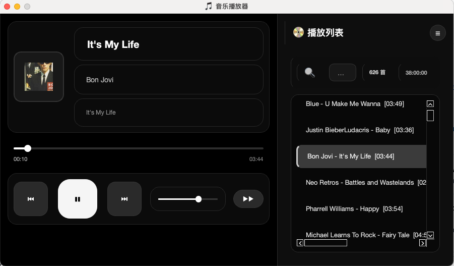

# 🎵 本地音乐播放器

一个使用 Python + PySide6 + Pygame 开发的桌面音乐播放器。


## ✨ 特性

### 基础功能
- 🎨 深色主题界面
- 🎵 支持 MP3、WAV、OGG、FLAC 等多种音频格式
- 📁 支持添加单个文件或整个文件夹
- 📝 播放列表管理
- ⏯️ 完整的播放控制（播放/暂停/停止/上一首/下一首）
- 🔊 音量调节
- 💾 自动保存播放列表和设置
- 🖱️ 双击播放列表项目即可播放
- 🔄 自动播放下一首

### v0.2 新功能
- 🎯 **可拖动进度条** - 快速跳转到歌曲任意位置
- 🔀 **多种播放模式** - 顺序播放、列表循环、随机播放、单曲循环
- 🔍 **搜索过滤** - 快速搜索歌曲、艺术家、专辑
- 🎨 **元数据显示** - 显示歌曲标题、艺术家、专辑、封面
- 💾 **播放列表管理** - 保存和加载多个播放列表
- ⌨️ **键盘快捷键** - 空格播放/暂停，方向键控制
- 🔔 **系统托盘** - 最小化到托盘，后台播放
- 🗑️ **右键删除** - 右键菜单删除单个歌曲
- 📊 **统计信息** - 显示歌曲数量和总时长
- 🏗️ **模块化架构** - MVC 架构，易于维护和扩展

## 🚀 安装

### 方式 1: 手动安装

1. 安装 Python 依赖：
```bash
pip3 install -r requirements.txt
```

如果遇到 pygame 安装问题，先安装系统依赖：
```bash
# macOS
brew install pkg-config sdl2 sdl2_mixer sdl2_image sdl2_ttf

# 然后重新安装
pip3 install -r requirements.txt
```

2. 运行播放器：

```bash
python3 music_player_app.py
```

### 方式 2: 使用打包的应用

1. 下载 `music-player-vx.x.dmg`
2. 双击打开 DMG 文件
3. 拖动应用到 Applications 文件夹
4. 在启动台或 Applications 文件夹中打开应用

### 方式 3: 自己打包

```bash
./build_app.sh
```

## 🎮 使用方法

### 基础操作

1. **添加音乐**：
   - 点击"➕ 添加音乐"按钮，选择音频文件
   - 点击"📁 添加文件夹"按钮，选择包含音乐的文件夹（会自动扫描子文件夹）

2. **播放音乐**：
   - 点击"▶ 播放"按钮播放当前选中的音乐
   - 双击播放列表中的歌曲直接播放
   - 拖动进度条跳转到任意位置

3. **控制播放**：
   - ⏮ 上一首：播放上一首歌曲
   - ▶/⏸ 播放/暂停：播放或暂停当前音乐
   - ⏭ 下一首：播放下一首歌曲
   - ⏹ 停止：停止播放

4. **播放模式**：
   - ⏩ 顺序：按顺序播放，播放完最后一首停止
   - 🔁 循环：循环播放整个列表
   - 🔀 随机：随机播放所有歌曲
   - 🔂 单曲：重复播放当前歌曲

5. **播放列表管理**：
   - 🔍 搜索框：搜索歌曲、艺术家、专辑
   - 右键菜单：删除单个歌曲
   - 💾 保存列表：保存当前播放列表
   - 📂 加载列表：加载已保存的播放列表
   - 🗑 清空列表：清空所有歌曲

6. **键盘快捷键**：
   - `空格`：播放/暂停
   - `→`：下一首
   - `←`：上一首
   - `↑`：增加音量 5%
   - `↓`：减少音量 5%

7. **系统托盘**：
   - 点击托盘图标：显示/隐藏窗口
   - 右键托盘图标：快速控制菜单

## 🎨 界面预览

- 深色主题配色（深蓝 + 粉红色调）
- 简洁现代的按钮设计
- 清晰的播放信息显示
- 友好的播放列表界面

## 📝 配置文件

播放器会自动在用户目录生成配置文件：

- 配置目录：`~/.config/music-player/`
- 配置文件：`~/.config/music-player/config.json`
- 播放列表：`~/.config/music-player/playlists/`
- 日志文件：`~/.config/music-player/music_player.log`

配置内容包括：
- 播放列表
- 音量设置
- 播放模式
- 窗口位置和大小
- 当前播放曲目和位置

## 🔧 技术栈

- Python 3.7+
- **PySide6**（GUI 界面 - Qt for Python 官方绑定）
- Pygame（音频播放）
- Mutagen（元数据读取）
- SDL2（音频后端）

> **注意**: PySide6 是 Qt 官方支持的 Python 绑定，提供更好的许可证（LGPL）和更活跃的社区支持。详见 [MIGRATION_TO_PYSIDE6.md](MIGRATION_TO_PYSIDE6.md)

## 🏗️ 项目结构

```
music_player/
├── models/              # 数据模型和业务逻辑
│   ├── playback_engine.py
│   ├── playlist_manager.py
│   ├── metadata_reader.py
│   ├── config_manager.py
│   └── track.py
├── views/               # UI 组件
│   ├── main_window.py
│   ├── control_panel.py
│   ├── playlist_view.py
│   └── system_tray.py
├── controllers/         # 控制器
│   └── player_controller.py
├── utils/               # 工具函数
│   └── logger.py
└── main.py             # 应用入口
```

## 📄 许可

MIT License

## 🤝 贡献

欢迎提交 Issue 和 Pull Request！


## 📂 项目文件结构

```
.
├── music_player/              # 主应用包
│   ├── models/                # 数据模型和业务逻辑
│   │   ├── playback_engine.py
│   │   ├── playlist_manager.py
│   │   ├── metadata_reader.py
│   │   ├── config_manager.py
│   │   ├── track.py
│   │   └── playback_mode.py
│   ├── views/                 # UI 组件
│   │   ├── main_window.py
│   │   ├── control_panel.py
│   │   ├── playlist_view.py
│   │   └── system_tray.py
│   ├── controllers/           # 控制器
│   │   └── player_controller.py
│   ├── utils/                 # 工具函数
│   │   └── logger.py
│   └── main.py               # 应用入口
├── music_player_app.py       # 启动脚本
├── test_components.py        # 组件测试
├── install_deps.sh           # 依赖安装脚本
├── requirements.txt          # Python 依赖
├── pytest.ini               # 测试配置
├── build_app.sh             # 打包脚本
├── README.md                # 项目介绍
├── QUICKSTART.md            # 快速开始
├── CHANGELOG.md             # 更新日志
└── .kiro/specs/             # Spec 文档
    └── music-player-enhancement/
        ├── requirements.md   # 需求文档
        ├── design.md        # 设计文档
        └── tasks.md         # 任务列表
```


## 🐛 问题反馈

如果遇到问题：
1. 查看日志文件：`~/.config/music-player/music_player.log`

---

**Made with ❤️ using Python, PySide6, and Pygame**
